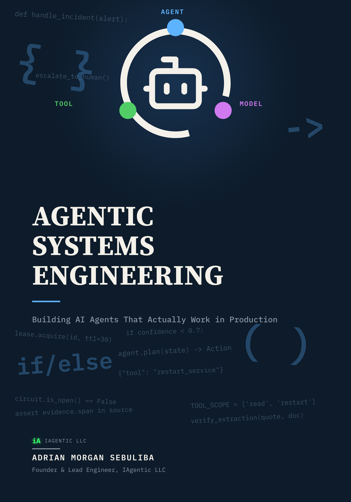

# Agentic Systems Engineering: Code Repository



Companion code for *Agentic Systems Engineering: Building AI Agents That Actually Work in Production*, by Adrian Morgan Sebuliba.

This repository contains the book's reference implementation only: two complete, tested systems (an SRE Agent and a Document Intelligence Agent) demonstrating every pattern the book covers, plus their test suite and live smoke test scripts. It does not contain the book's text, which is a separate, paid work.

## Get the book

📘 [Kindle](https://www.amazon.com/dp/B0HK1JVHB5) · [Paperback](https://www.amazon.com/dp/B0HK1G4SYW)

## Production AI Agent Engineering series

This is Book 1. Four more follow the same rule, real code, real tests, real recorded runs backing every claim in the text:

| # | Book | Code |
|---|---|---|
| 1 | Agentic Systems Engineering | this repo |
| 2 | Building Reliable AI Agents | [reliable-agents-labs](https://github.com/Sebuliba-Adrian/reliable-agents-labs) |
| 3 | Production AI Products | [triage-app](https://github.com/IAgentic-LLC/triage-app) · [pkgintel-app](https://github.com/IAgentic-LLC/pkgintel-app) · [reorder-app](https://github.com/IAgentic-LLC/reorder-app) |
| 4 | Evaluating AI Agents | [agent-evals](https://github.com/IAgentic-LLC/agent-evals) |
| 5 | Building Production Voice AI Agents | [voice-agents](https://github.com/IAgentic-LLC/voice-agents) |

## Getting started

```
git clone https://github.com/IAgenticc/Agentic-Book.git
cd Agentic-Book/reference
pip install -e ".[dev]"
pytest -v
```

See [`reference/README.md`](reference/README.md) for the full layout, chapter-to-module map, how to run against real models and real databases, and the real bugs this code found along the way.

## License

MIT, see [`LICENSE`](LICENSE).
